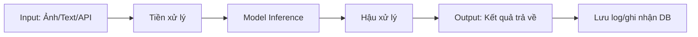
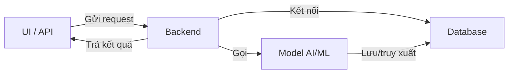
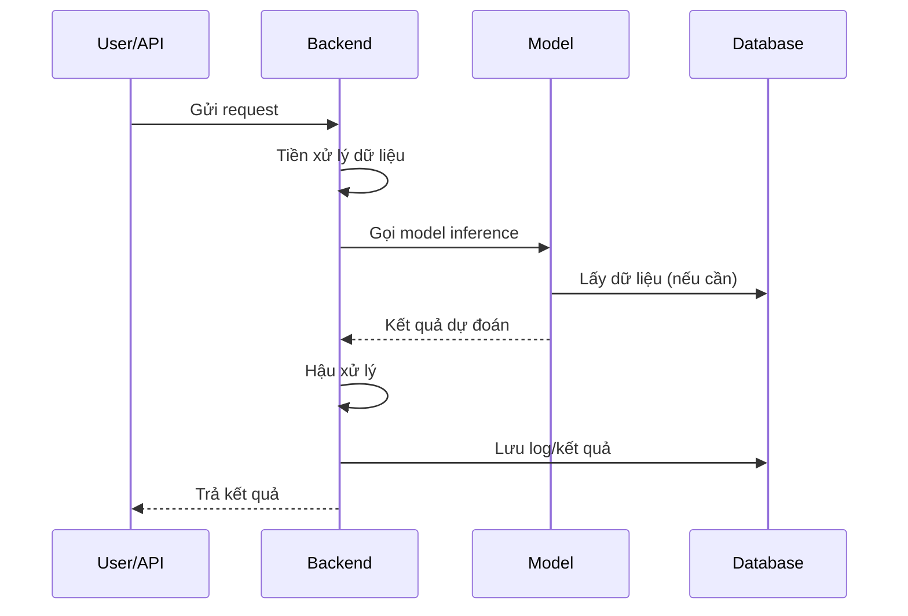

## Flow chi tiết: Từ input đến output

### 1. Nhận input
- Người dùng gửi dữ liệu (ảnh, text, v.v.) qua giao diện hoặc API.

### 2. Tiền xử lý (Preprocessing)
- Kiểm tra, xác thực định dạng dữ liệu.
- Làm sạch, chuẩn hóa dữ liệu đầu vào (resize ảnh, chuẩn hóa text, v.v.).

### 3. Xử lý bởi mô hình (Model Inference)
- Dữ liệu đã chuẩn hóa được đưa vào mô hình AI/ML.
- Mô hình thực hiện dự đoán/phân tích.

### 4. Hậu xử lý (Postprocessing)
- Chuyển đổi kết quả model về định dạng phù hợp với người dùng.
- Áp dụng các quy tắc nghiệp vụ (nếu có).

### 5. Trả output
- Kết quả cuối cùng được trả về cho người dùng qua API/UI.
- Lưu log, ghi nhận kết quả vào database nếu cần.

#### Sơ đồ minh họa:

# Application Flow Overview

## Sơ đồ tổng thể hệ thống (Block Diagram)

## 1. Tổng quan luồng hoạt động
- Người dùng gửi yêu cầu (API/UI)
- Backend nhận request, xác thực và xử lý dữ liệu đầu vào
- Hệ thống thực hiện inference/model processing (nếu có)
- Kết quả được trả về cho người dùng
- Lưu trữ log/thông tin cần thiết

## Flow chart: Luồng xử lý chính

## 3. Các bước chính
1. **Nhận request**: API hoặc giao diện người dùng gửi dữ liệu lên server.
2. **Tiền xử lý**: Làm sạch, chuẩn hóa, kiểm tra dữ liệu đầu vào.
3. **Inference/model**: Gọi mô hình AI/ML để dự đoán hoặc xử lý.
4. **Hậu xử lý**: Chuyển đổi kết quả về định dạng phù hợp, kiểm tra lỗi.
5. **Trả kết quả**: Gửi kết quả về cho client.
6. **Lưu trữ/ghi log**: Lưu thông tin cần thiết phục vụ kiểm tra, thống kê.

## 4. Ghi chú
- Có thể mở rộng thêm các bước như xác thực, phân quyền, kiểm tra lỗi, gửi thông báo...
- Tùy từng module sẽ có flow chi tiết hơn.

---

# Đề xuất trình bày slide phần implement

## Slide 1: Tổng quan kiến trúc
- Sơ đồ tổng thể hệ thống (block diagram)
- Các thành phần chính: UI/API, Backend, Model, Database

## Slide 2: Luồng xử lý chính
- Flow chart hoặc sequence diagram mô tả các bước chính từ nhận request đến trả kết quả

## Slide 3: Chi tiết từng module
- Mỗi module (API, model, database, service) trình bày:
    - Chức năng chính
    - Input/Output
    - Công nghệ sử dụng

## Slide 4: Demo/Ảnh minh họa
- Ảnh chụp màn hình, ví dụ request/response, kết quả thực tế

## Slide 5: Kết luận & hướng phát triển
- Tổng kết lại flow
- Đề xuất cải tiến, mở rộng trong tương lai
